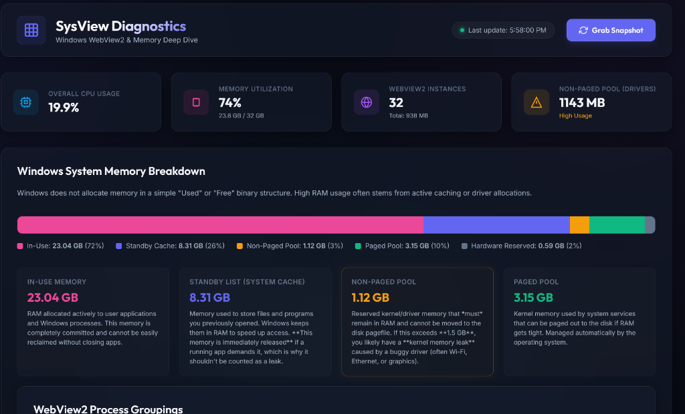

# SysView 🖥️

A modern, glassmorphic Windows resource and memory diagnostics dashboard designed to expose hidden RAM consumption, map Microsoft Edge WebView2 embedded frames, analyze WSL2/virtualization ballooning, and provide safety-classified background process insights.



---

## ✨ Features

* **📊 Live Memory Allocation Stack**: Mathematically maps active In-Use RAM, Standby File Cache (System Cache), Non-Paged Pool (Driver memory), Paged Pool, and Hardware Reserved memory modules.
* **🌐 Edge WebView2 Instance Grouper**: Groups and identifies opaque `msedgewebview2.exe` sub-processes by their parent applications (e.g. Teams, Outlook, Antigravity IDE). Displays individual tab names, GPU modules, utility tasks, and exact PID profiles.
* **🛡️ Interactive Process Safety Analyzer**: Displays the top background memory hogs with color-coded safety indicators (🟢 Safe to close, 🟡 System service/Caution, 🔴 Critical OS component). Click any row to expand a rich description of what the process does and what happens if you close it.
* **🐳 WSL2 & Hyper-V Ballooning Controller**: Detects active virtual machine instances (`vmmemWSL` / `vmmem`), parses active Linux distributions, warns you if a memory-capping `.wslconfig` is missing, and provides a **one-click shutdown button** to reclaim up to 20GB+ of locked RAM.
* **💡 Diagnostics & Advice Engine**: Dynamically scans your system for memory anomalies (such as kernel driver leaks, memory saturation, or missing caps) and recommends concrete, real-world remedies.
* **📈 Bounded History & Redacted Export**: Bounded 15-min history with deltas/sparklines and redacted JSON export for support/triage (auto-refresh 2s/5s/10s, Pause/Resume, per-sample sparklines; export strips CommandLine by default).
---

## 🛠️ Architecture & Core Mechanics

* **Backend (Go)**: A lightweight, portable Go HTTP server that serves web assets embedded directly in the binary using `go:embed` for zero-dependency execution.
* **Collector (PowerShell)**: A safe collector script (`snapshot.ps1`) that executes locally within standard user privilege bounds (no Administrator required) using WMI queries and process mappings.
* **Frontend (HTML5/CSS3/JS)**: A dark-mode glassmorphic interface powered by Vanilla CSS and raw JavaScript with responsive designs, flex layouts, and smooth animations.

---

## 📦 Install

SysView is a **single binary** — no installer, no dependencies, fully **offline** after download. Data never leaves `[IP_ADDRESS]`; the server binds to loopback and requires a per-launch capability token.

### winget (Windows Package Manager)

```powershell
# From winget-pkgs (once published)
winget install SysView.SysView

# Or install directly from this repo's manifest
winget install --manifest winget.yaml
```

Manifest: [`winget.yaml`](winget.yaml) · PackageIdentifier `SysView.SysView` · version `0.2.0` · Scope `user` · portable/x64.

### Scoop

```powershell
# Add bucket (if you publish a bucket) or install from local manifest
scoop install scoop.json

# With a bucket named sysview:
# scoop bucket add sysview https://github.com/SysView/scoop-bucket
# scoop install sysview
```

Manifest: [`scoop.json`](scoop.json) · `64bit` URL placeholder — replace `PLACEHOLDER_SHA256` on release · `bin` → `SysView.exe` · `checkver` tracks GitHub releases.

### Manual — Build from Source

Prerequisites: **Go 1.21+** on Windows.

```powershell
# Clone and build a stripped binary (~6 MB)
git clone https://github.com/SysView/SysView.git
cd SysView
go build -ldflags "-s -w -X main.version=0.2.0 -X main.commit=$(git rev-parse --short HEAD)" -o SysView.exe

# Run (auto-picks 22880, then 22881…)
.\SysView.exe
# Or pin a port
.\SysView.exe -port 8080
```

The binary embeds `static/*` and `snapshot.ps1` — just copy `SysView.exe` anywhere.

> License: [MIT](LICENSE) · See [`LICENSE`](LICENSE) for details.

---

## 🚀 Getting Started

### Prerequisites

To compile SysView, you need to have **Go** installed on your Windows machine:
1. Download and install Go from [golang.org/dl](https://golang.org/dl/).
2. Verify installation:
   ```powershell
   go version
   ```

### 1. Build from Source

Clone the repository, navigate into the directory, and compile the optimized binary:

```powershell
# Compile stripped binary (reducing size to ~6MB)
go build -ldflags "-s -w" -o SysView.exe
```

### 2. Run the Utility

You have two convenient ways to run and manage the diagnostics server:

#### Option A: Use the Desktop Service Manager (Recommended)
We have included a lightweight desktop controller app:
1. Double-click **`SysView.bat`** in your project folder.
2. This opens the dark-themed **SysView Service Manager** window.
3. Configure your desired port (defaults to `22880` and saves to `config.json`), click **Start Server**, and click **Open Web UI** to view the dashboard! You can stop the background process at any time by clicking **Stop Server**.

#### Option B: Run via Command Line
Alternatively, you can start the executable directly from your PowerShell terminal:

```powershell
# Run with default port auto-detection (checks 22880, then 22881, etc.)
.\SysView.exe

# Override and bind to a specific port directly
.\SysView.exe -port 8080
```

---

## 🖥️ Headless / Fleet

Run without the HTTP server or browser — ideal for RMM, Intune, or scheduled collection. Writes the same `envelope` JSON (capturedAt, schemaVersion 3, providers, data) to stdout or a file, with 12s timeout and validation. Redaction is on by default.

```powershell
# Write to stdout (redacted by default), pretty-printed
.\SysView.exe --headless --pretty

# Write to file (default redacted)
.\SysView.exe --headless --output snapshot.json

# Alias for --headless (same behaviour)
.\SysView.exe --once --output snapshot.json

# Pretty + file
.\SysView.exe --headless --pretty --output snapshot.json

# Include secrets (disable redaction) — CommandLine/Command kept verbatim
.\SysView.exe --headless --redact=false --output snapshot.json

# --headless is the same as --once; --once is kept as an alias for fleet scripts
```

Flags:

| Flag | Type | Default | Description |
|------|------|---------|-------------|
| `--headless` | bool | `false` | Run once, write JSON, exit (no server/browser) |
| `--once` | bool | `false` | Alias for `--headless` |
| `--output` | string | `""` (stdout) | Output file for headless mode |
| `--pretty` | bool | `false` | Pretty-print JSON (`MarshalIndent`) |
| `--redact` | bool | `true` | Redact `AllProcesses[].CommandLine`, `WebViewProcesses[].CommandLine`, `Startup[].Command` → `"[redacted]"` |

Exit codes: `0` on success, `1` on collection/validation/write failure (JSON error to stderr). No HTTP server or browser is started in headless mode.

---

## 🔧 One-click Fixers

SysView can **fix**, not just view — starting with a safe, audited one-click fixer for standby file-cache bloat.

### Reclaim Standby (Empty Standby List) — Safe

Releases Windows **Standby file cache** (disk cache held in Available memory) back to free memory without touching running apps or unsaved work. Windows repopulates the cache as needed — this is a safe, non-destructive purge.

**What it does:**
- Calls the Windows `NtSetSystemInformation` (`SystemMemoryListInformation` 80, `MemoryPurgeStandbyList=4`) via a short PowerShell P/Invoke snippet (tries `SeProfileSingleProcessPrivilege` enable). This empties the Standby List — file-cache pages only, not working sets of apps.
- Measures **Before → After** standby bytes via `Win32_PerfFormattedData_PerfOS_Memory` (`StandbyCacheCoreBytes + StandbyCacheNormalPriorityBytes + StandbyCacheReserveBytes`) and returns:
  ```json
  {"status":"success","beforeBytes":7320123456,"afterBytes":5450000000,"reclaimedBytes":1870123456,"message":"Standby reclaimed: 6.82 GB → 5.08 GB (1826 MB freed)"}
  ```

**How to use:**
1. Open the dashboard and find the **Memory Allocation Stack / Standby** card.
2. Click **Reclaim Standby** (below the standby size). You’ll see a confirmation:
   ```
   Reclaim 6.8 GB standby cache?

   Before: 6.8 GB standby

   This releases file cache to Available memory. No apps or unsaved work are affected. Windows will repopulate cache as needed.

   Proceed?
   ```
3. Confirm → button shows “Reclaiming…” → result banner appears (aria-live) with `Standby 6.8 → 5.1 GB (1.7 GB reclaimed)` and the dashboard auto-refreshes deltas. No server restart is needed.

**File cache vs apps:**
> Standby is **file cache**, not app private memory. Reclaiming it frees cached file data (e.g. recently read files) to Available memory; active apps keep their working sets. No data loss, no app close.

**Admin requirement:**
- On most builds reclaim requires **Administrator**. If you run `SysView.exe` as normal user, the API returns:
  ```json
  {"error":"Requires Administrator","details":"Run SysView.exe as Administrator to reclaim standby"}
  ```
  The UI shows this as a warning banner with guidance — it does not crash. Right-click `SysView.exe` → **Run as administrator** and retry.
- Technically: the P/Invoke returns `STATUS_PRIVILEGE_NOT_HELD` (`0xC0000061` / 1314) or `Access denied` → handler maps to `403 Requires Administrator`.

**Before/After & audit:**
- The result banner shows `Before → After` in GB and MB freed. A subsequent `GET /api/snapshot` refreshes the memory stack and sparklines so you can see the delta.
- The action is gated by token + origin + explicit `{"confirm":true}` and a concurrency cap of 1 (`429 Reclaim already in progress`, 12s timeout).

**No server restart needed:**
- Reclaim is a one-off `POST /api/reclaim/standby` — it does not restart the server or WSL. Your session continues; just the standby cache is purged.

**API contract (for scripts/RMM):**
```http
POST /api/reclaim/standby
Headers: X-SysView-Token: <capabilityToken>, Content-Type: application/json
Body: {"confirm": true}
Responses:
  200 {status:"success", beforeBytes, afterBytes, reclaimedBytes, message:"Standby reclaimed: X GB → Y GB (Z MB freed)"}
  400 {error:"Confirmation required"}
  403 {error:"Requires Administrator", details:"Run SysView.exe as Administrator to reclaim standby"}
  403 {error:"Missing or invalid capability token"}
  429 {error:"Reclaim already in progress"}
  500 {error:"Reclaim failed", details: ...}
  405 on GET
```

### Cap WSL — Preview + Write `.wslconfig` (No Auto-Shutdown)

Permanently caps WSL2 memory by writing `%UserProfile%\.wslconfig` `[wsl2] memory=4GB` — preview first, no automatic `wsl --shutdown` (you trigger shutdown separately when ready).

**What it does:**
- Validates `memory` strictly with regex `^\d+(\.\d+)?\s*(GB|MB|G|M)$` (e.g. `4GB`, `4096MB`, `4G`, `4096M` → normalized to `4GB`/`4096MB`; bare `4` → `4GB`). On invalid → `400 {error:"Invalid memory value", details:"Expected e.g. 4GB, 4096MB"}`.
- Preserves other sections and keys: reads existing `.wslconfig` if present, parses `INI`-style sections, updates/creates `[wsl2] memory=` while keeping comments and unrelated keys (e.g. `[wsl2] processors=4`, `[experimental] autoMemoryReclaim=gradual`).
- Writes atomically via temp file + `os.Rename` (crash-safe), returns:
  ```json
  {"status":"success","path":"C:\\Users\\you\\.wslconfig","memory":"4GB","message":"Wrote memory=4GB to .wslconfig"}
  ```
- Never calls `wsl --shutdown` — the existing **Shut Down WSL** button remains separate and user-controlled. Use it after capping if you want the limit to take effect immediately.

**How to use:**
1. Open the dashboard → **WSL2 & Container Virtualization Analyzer** card → find the **Cap WSL** wizard (input + preview + Write button).
2. Type a cap (placeholder `4GB`) → preview `<pre>` updates live (textContent) to `[wsl2]\nmemory=4GB` (aria-live, reuses code-preview tokens).
3. Click **Write .wslconfig** → confirmation dialog:
   ```
   Write memory=4GB to %UserProfile%\.wslconfig?

   Preview:
   [wsl2]
   memory=4GB

   Existing settings in other sections will be preserved. This does not shut down WSL — use "Shut Down WSL" separately if you want the cap to take effect immediately.

   Proceed?
   ```
4. Confirm → button shows “Writing…” → result banner (success green / invalid red / busy warning, aria-live) appears and dashboard refreshes config status via snapshot. No server restart needed.

**Preserves other settings:**
> Existing `.wslconfig` content outside `[wsl2] memory` is kept. Example: a file with `[wsl2]\nprocessors=4\nmemory=8GB\n[experimental]\nautoMemoryReclaim=gradual` rewritten as `memory=4GB` retains `processors=4` and the `[experimental]` section. If no `[wsl2]` exists, one is appended. Atomic temp+rename ensures no half-written file on crash.

**Validation examples:**
| Input | Normalized | Result |
|-------|------------|--------|
| `4GB` | `4GB` | 200 success |
| `4096MB` | `4096MB` | 200 success |
| `4G` | `4GB` | 200 success |
| `4` | `4GB` | 200 success (unit defaults to GB) |
| `not-a-size` | — | 400 Invalid memory value |
| `""` / missing | — | 400 Invalid memory value |

**Error handling:**
- `400 Confirmation required` if `confirm` missing/false.
- `400 Invalid memory value` with `details: "Expected e.g. 4GB, 4096MB"` on bad input.
- `403 Missing or invalid capability token` / `403 Forbidden origin` (token+origin gated, like reclaim).
- `429 WSL config write already in progress` (concurrency cap 1 via `wslConfigSem`, try-lock).
- `500 Failed to write .wslconfig` with OS details (e.g. cannot resolve home directory, temp file error).
- `405 Method not allowed. Use POST.` on GET.

**No auto-shutdown — separate button:**
> Capping does not shut down WSL. The separate **Shut Down WSL** button (`POST /api/wsl/shutdown`) remains the user-controlled way to apply the cap immediately. Until shutdown, WSL keeps running with its current reservation; after `wsl --shutdown` the next distro start respects the new cap.

**API contract (for scripts/RMM):**
```http
POST /api/wsl/config
Headers: X-SysView-Token: <capabilityToken>, Content-Type: application/json
Body: {"memory":"4GB","confirm": true}
Responses:
  200 {status:"success", path, memory, message:"Wrote memory=4GB to .wslconfig"}
  400 {error:"Invalid memory value", details:"Expected e.g. 4GB, 4096MB"}
  400 {error:"Confirmation required"}
  403 {error:"Missing or invalid capability token"}
  403 {error:"Forbidden origin"}
  405 {error:"Method not allowed. Use POST."}
  429 {error:"WSL config write already in progress"}
  500 {error:"Failed to write .wslconfig", details: ...}
  405 on GET
```

### Restart Runtime Host — Safe (Teams/Code/Electron/Node)

Restarts the **host** process (e.g. Teams, Code) and its embedded pages by stopping the *host* PID only — never mass-killing children. Requires explicit confirmation that lists the host name, PID, child count and working set so you know what will close.

**What it does:**
- Validates the request: `host` + `pid` must be present, `pid > 4` (rejects PID 0 / 4 and other critical system PIDs), `confirm:true` required, token + origin gated, concurrency cap 1 (`429 Runtime restart already in progress`, 10s timeout).
- Checks the PID exists via PowerShell `Get-Process -Id <pid>` — on missing PID returns `400 {error:"PID not found"}`.
- Validates the `host` name matches the process name (case-insensitive) — mismatch is warned but not blocked (host groups are snapshot-derived).
- Stops only the host: `Stop-Process -Id <pid> -Force` — child WebView2/GPU/utility processes exit with their host; SysView never enumerates or kills children directly.
- On success returns:
  ```json
  {"status":"success","host":"Teams","pid":12345,"message":"Sent restart signal to Teams (PID 12345)"}
  ```
  On PowerShell failure returns `500 {error:"Failed to restart host", details: ...}`.

**How to use:**
1. Open the dashboard → **Runtime Groups** card (Teams/Code/Electron/Node) → find the **Restart host** button (`.btn-secondary.runtime-restart-btn`, per host row, `data-host`/`data-pid`).
2. Click **Restart host** → confirmation dialog:
   ```
   Restart Teams? (PID 12345, 12 children, 2.1 GB)

   This will close Teams and its embedded pages. Unsaved work will be lost. Windows may relaunch the app automatically, or you may need to start it manually.

   Proceed?
   ```
3. Confirm → button shows “Restarting…” → result banner (`#runtime-restart-result`, `aria-live="polite"`) appears (success green / 400/403/429 warning / 500 danger, textContent only) and the dashboard auto-refreshes via `grabSnapshot()` so the RuntimeGroups list updates. Result banner reuses the same token styling as Reclaim/Cap fixers.

**Host not children:**
> Only the host PID is stopped. Children (WebView2 tabs, GPU, utility) are not killed individually — they terminate when their host exits. No mass-kill, no orphan scan, no `taskkill /T`.

**Unsaved work warning:**
> The confirmation explicitly warns: **“Unsaved work in Teams will be lost.”** Do not restart if you have unsent messages, unsaved documents, or in-progress calls in that host.

**Manual relaunch note:**
> Windows *may* auto-relaunch Teams/Outlook on close, but this is not guaranteed — you may need to start the app manually from Start / taskbar after the restart. The result message on success says `Sent restart signal…`; verify the host reappears in RuntimeGroups after the next snapshot poll.

**Validation:**
>| Input | Result |
>|-------|--------|
>| `{"host":"Teams","pid":12345,"confirm":true}` + token+origin | 200 success |
>| missing `confirm` / `confirm:false` | 400 Confirmation required |
>| missing `host` / `pid` or `pid` 0–4 | 400 Host and PID required |
>| `pid` not found (`Get-Process` fails) | 400 PID not found |
>| `pid` ≤4 (critical) | 400 Host and PID required (pre-PS), or 400 Not a runtime host |
>| evil `Origin` / missing `X-SysView-Token` | 403 Forbidden origin / Missing or invalid capability token |
>| concurrent POST while one in-flight | 429 Runtime restart already in progress |
>| PowerShell `Stop-Process` fails | 500 Failed to restart host |
>| GET | 405 Method not allowed. Use POST. |

**Pid validation detail:**
> `pid` must be `> 4` — PID 0 (System Idle) and PID 4 (System) are rejected at the handler before any PowerShell invocation. Any future `RequireToken`-like hardening will keep this floor; tests assert both `0` and `2` map to `400 Host and PID required`.

**API contract (for scripts/RMM):**
```http
POST /api/runtime/restart
Headers: X-SysView-Token: <capabilityToken>, Content-Type: application/json
Body: {"host":"Teams","pid":12345,"confirm":true}
Responses:
  200 {status:"success", host:"Teams", pid:12345, message:"Sent restart signal to Teams (PID 12345)"}
  400 {error:"Confirmation required"}
  400 {error:"Host and PID required"}
  400 {error:"PID not found"}
  400 {error:"Not a runtime host"}
  403 {error:"Missing or invalid capability token"}
  403 {error:"Forbidden origin"}
  405 {error:"Method not allowed. Use POST."}
  429 {error:"Runtime restart already in progress"}
  500 {error:"Failed to restart host", details: ...}
  405 on GET
```

## 💡 Troubleshooting WSL2 Memory Starvation

If your computer is consistently running out of RAM and `vmmemWSL` is consuming upwards of 15GB+:
1. Open the SysView dashboard and check the **WSL2 & Container Virtualization Analyzer** panel.
2. Click **Shut Down WSL & Reclaim Memory** (ensure you have quit **Docker Desktop** first, as it will automatically restart WSL if active).
3. **Cap WSL permanently**:
   * Open your User Profile directory (`Win+R` -> `%USERPROFILE%`).
   * Create a file named `.wslconfig`.
   * Add the following lines to limit WSL's memory consumption (e.g., to 4GB):
     ```ini
     [wsl2]
     memory=4GB
     ```
   * Save the file and restart WSL.

---

## 📄 License

This project is licensed under the MIT License - see the LICENSE file for details.
